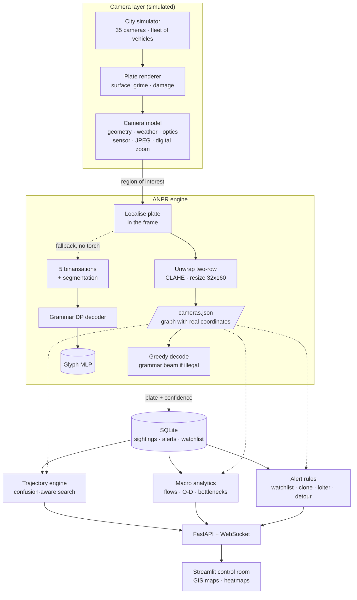

# 👁 GodsEye — city-wide ANPR intelligence platform

**SIH 2026 · Team Armageddon**
**Theme: Smart Automation / Public Safety · Category: Software**

Most cities already own the cameras. What they do not own is a system that joins
those cameras together — that can take one plate number and reconstruct where
that vehicle has been all day, and at the same time turn the same stream of
reads into a live picture of how the whole city is moving.

GodsEye is that layer: a plate reader built for bad photographs, a spatial-
temporal trajectory engine over a GIS camera network, macro traffic analytics
derived from the same reads, and a real-time alert queue on top of both.

---

## Run it

```bash
pip install -r requirements.txt

python seed.py                                  # 6 h of city traffic into SQLite (~20 s)
uvicorn api.main:app --reload --port 8000       # API + live feed  → http://localhost:8000/docs
streamlit run dashboard/app.py                  # control room     → http://localhost:8501
```

The very first run trains the glyph classifier — 3–5 minutes, CPU only — and
caches it in `models/`; every run after that starts in seconds. Nothing here
needs a GPU, an internet connection, or a dataset download. To see the numbers
behind the accuracy claim, and to check every layer end to end:

```bash
python -m anpr.benchmark --samples 100 --scenes 60 --layouts 100 --json models/benchmark.json
python -m anpr.camera_sheet                     # see what the camera model produces
python -m anpr.compare_backends --samples 100   # CRNN vs the classical engine
python tests.py                                 # end-to-end self-check
```

The dashboard reads the database directly, so it works with the API stopped —
the API process is what runs the live camera feed and the incident injectors.

---

## Architecture



---

## 1 · The plate reader

The hard part of ANPR is not clean plates. It is the 9 p.m. capture through
rain, at 30° off-axis, on a plate half covered in road grime. The engine is
built around that case.

**Pipeline.** Locate the plate in the frame → normalise (deskew from the ink
cloud, CLAHE, height set by aspect ratio) → divide out the background field so
mud, shadow and glare gradients disappear → Otsu → cluster the marks into text
rows → deliberately *over*-segment each row into atoms → decode.

**It is benchmarked on what a gantry camera actually sends.** Captures are not
clean renders with filters over them: they come from a physical camera model
(`anpr/camera.py`) that starts from a pole five to eight metres up looking down
at the carriageway, and runs eight stages in the order the physics happens —
surface, geometry, atmosphere, illumination, optics, sensor, JPEG encoder, then
the operator's crop and digital zoom. The consequences dominate every weather
effect: the plate lands **40–260 px wide** in the sensor, gets compressed at
that size, and is then upscaled with its own artefacts. `AUGMENTATION.md` has
the full account, including the three calibration errors that were caught by
looking at a contact sheet rather than by reading the code.

**It reads the plates that are actually on the road.** One-row and two-row
layouts (motorcycles, autos and trucks carry two rows, and normalising both to
the same pixel height would halve the two-row characters, so the target height
follows the aspect ratio); white private and yellow commercial plates; and the
blue IND band of a High Security plate, which is removed with the frame rather
than read — left in, it eats the first character and costs ten points of
accuracy. Training and benchmarking run across ten typefaces, because Indian
plates are supposed to use one prescribed face and in practice use whatever the
shop had.

**The recogniser is a CRNN, and the reason is measurable.** The original
pipeline segmented the plate into characters and classified each one. That
scored 87% on the old filter-based corpus and **16%** on camera-realistic
captures, and the bottleneck was localised by elimination rather than guessed:
perspective rectification, decoder merge depth, atom caps and morphology kernels
each moved it by a point or less, while held-out glyph accuracy sat at 98% on a
training mix dominated by easy crops.

The structural problem is that **segmentation is a decision made too early**.
After a gantry capture has been through a JPEG encoder at 90 px wide and a 3x
digital zoom, the gaps between characters are not reliably in the image any
more, and a pipeline that must find them before recognising anything is betting
on information that is gone. A CRNN never makes that decision: a convolutional
stack slides across the plate, a bidirectional GRU carries context along it, and
CTC marginalises over every alignment between output columns and the string.
Character boundaries stay latent.

Head to head on identical captures:

| | segment-and-classify | CRNN |
|---|---|---|
| daylight | 53% | **74%** |
| night IR | 48% | **81%** |
| monsoon | 27% | 58% |
| fog | 14% | 37% |
| high speed | 3% | 25% |
| dusk, high ISO | 4% | 25% |
| far lane | 1% | 11% |
| **overall** | **16.4%** | **35.0%** |
| **per read** | 124 ms | **18 ms** |

Twice the accuracy at a seventh of the cost, and the gap is widest exactly where
the classical pipeline collapsed — motion blur, dusk, fog — which are the
captures where the character boundaries genuinely are not there.

`anpr/compare_backends.py` reproduces that table. The classical engine is kept
as an automatic fallback: without torch, or without trained weights, the
platform runs exactly as it did before.

**Three things the measurements changed my mind about.**

*The plate grammar is now nearly redundant.* It was worth several points when a
per-character classifier had no context to stop a `B` landing in a digit slot.
The BiGRU sees the whole plate and learns that structure from the data: greedy
decoding scores 37.2%, the grammar beam 38.0% — **+0.8 points for 530x the
decode cost**. The default is now greedy, with the beam run only when greedy
returns something that is not a valid registration shape, which keeps the
guarantee that a stored string is always well-formed.

*My first beam search was wrong, and the measurement said so unambiguously.* It
scored **below** greedy (24.0% against 27.0%). A grammar can only remove illegal
strings, so losing to greedy means the search is broken — I had collapsed the
blank and non-blank path probabilities that CTC prefix beam search has to track
separately.

*Two-row plates were being destroyed by preprocessing.* Squashing a motorcycle
plate into a 32-pixel strip leaves each row about fourteen pixels tall: 2% plate
accuracy. They are now split at their character bands and laid out as one line.
Detecting that by canvas aspect ratio does not work — a camera crop carries
margin and perspective, so an ordinary single-row capture arrives at 2.4:1 and
gets cut in half — so the rows are found from the horizontal ink profile.

**The classical decoder** (still the fallback) — classical pipelines commit to one
segmentation and then classify, so a smeared `KA` fused into one blob is
unrecoverable. Here the segmenter is allowed to cut too much, and a dynamic
program searches every way of grouping 1–3 adjacent atoms into characters —
with a third move available, dropping an atom as noise, because mud specks and
rivets segment like characters too. Each grouping is scored against the Bharat
plate grammar (`LL DD LLL DDDD`), which rules out whole families of errors: a
digit can never win a letter slot. Five binarisation hypotheses are decoded and
the highest-scoring read wins.

**The classical classifier is trained in stages**, all on synthetic plates with
known ground truth:

1. *Segmentation-aligned* — plates pushed through the real segmenter, kept only
   where the box count matches the plate length, so every label is certain.
2. *Decoder-aligned self-training* — the stage-1 engine reads a fresh batch of
   hard plates; where the decode matches ground truth, the decoder's own
   character spans are harvested as labelled crops. This recovers exactly what
   stage 1 discards — merged characters, mud-covered strokes, fragments glued
   back together.

Held-out glyph accuracy: **98.7%** over 36 classes  from 46 986 training crops.
Plate-level accuracy is in the table below.

**Confidence is agreement between hypotheses, not the winner's own score.**
Two things go into it. The weakest character, because one wrong glyph makes the
whole registration wrong and the mean would hide it. And — far more
informative — how many of the eight binarisation hypotheses decoded the *same*
string. The winner is chosen as the highest-scoring of the eight, so its own
confidence is inflated by that selection: measured over 500 reads it sits at
0.99 on correct reads and 0.89 on wrong ones, which barely separates them.
Agreement is not selected for in the same way and scores 0.80 against 0.26.

That is what makes the confidence floor work, and it changes the operational
picture completely: the platform discards 24% of captures and what it does
store is **97.4%** correct, against 86.8% if it stored everything. On the
dirty condition it accepts only a quarter of reads — and every one of those is
right. For a platform that puts a registration in front of a police officer,
refusing to answer is the correct answer.

### Reading a photograph

`read_frame()` takes a whole picture rather than a tight crop. A morphological
localiser proposes plate-shaped regions — a plate is a horizontal band of
tightly-spaced vertical strokes, which a gradient and a wide closing pull out of
a scene while leaving most of it behind — and each region is decoded at a few
insets, because a box that carries a strip of bumper into the binariser reads
worse than one cut slightly tight. The most confident legal read wins.

**When it finds nothing it says why.** The dashboard draws the regions it
examined and reports, in words, what failed: no plate-shaped region, or regions
that held no arrangement of characters spelling a valid registration. That
matters because the honest answer to "why did my photo of a notebook page not
read?" is that this is a *number-plate* reader — the plate grammar is what buys
the accuracy in the table below, and the same grammar is what makes it refuse
handwriting, signage and arbitrary text. It is not a general OCR.

### Measured accuracy

| Capture condition | Plate accuracy | Character accuracy | Stored | Accuracy of stored reads |
|---|---|---|---|---|
| clean | 90% | 97.4% | 94/100 | 95% |
| night / low light | 96% | 98.2% | 92/100 | 100% |
| headlight glare | 96% | 97.3% | 87/100 | 99% |
| rain | 92% | 96.8% | 81/100 | 99% |
| motion blur | 85% | 93.0% | 71/100 | 97% |
| angled (perspective) | 83% | 92.4% | 71/100 | 100% |
| dirty / grimy | 67% | 87.3% | 25/100 | 100% |
| damaged plate | 77% | 94.2% | 69/100 | 90% |
| low resolution | 93% | 97.6% | 94/100 | 97% |
| mixed (two at once) | 89% | 95.3% | 73/100 | 99% |
| **overall** | **86.8%** | **94.9%** | 757/1000 | **97.4%** |

1,000 plates, 100 per condition, decoded at 10 plates/s on a single CPU core. On 60 composited whole-frame scenes the localiser found the plate 98% of the time and the platform read it correctly 52% of the time, at 0.49 s a frame.


By plate layout, at 100 plates each:

| Layout | Plate accuracy |
|---|---|
| one row | 88% |
| one row + IND band | 79% |
| two rows | 83% |
| two rows + IND band | 85% |

`anpr/benchmark.py` produces these tables; it is not a quoted figure. *Plate*
means the entire string matched exactly. *Accepted* is the operational number:
of the reads the engine was confident enough to store, how many were exactly
right — a read below the confidence floor is dropped rather than written, which is
what a real ANPR node does.

**The plate distribution.** Every benchmark plate is drawn across the ten
typefaces, with 18 % two-row layouts, 45 % carrying an IND band, and both plate
colours — a harder and more realistic mix than a single rendered font.


**Against the >90 % target.** On the reads it stands behind, the engine is at
97.4%. On every read including the ones it rejects, it is 86.8% exact-string
and 94.9% per character — five of the ten conditions clear 90 %, and dirt
(67%) and physical damage (77%) are what hold the average down. An
earlier build measured 91.2 % overall, but on an easier corpus: one font, one
row, no IND band. Widening the corpus to ten typefaces, two-row plates and High
Security plates cost about four points and is the more honest number. Closing
the remaining gap is a model problem rather than a pipeline one — the character
classifier is a CPU-trained MLP, and a small CNN on real plate crops is the
next step.

**What the conditions are.** Each is a *site*, not a filter: a mounting height,
a distance, a lens, a shutter, an ISO and the weather, from which everything
else follows. `daylight` is a fast shutter at midday; `night_ir` is an infrared
illuminator on retroreflective sheeting, which is often *easier* than dusk;
`night_glare` puts an oncoming headlight in frame and fools the auto-exposure;
`monsoon` adds motion-blurred rain streaks, veiling and a wet lens that refracts
rather than dims; `fog` applies Koschmieder scattering scaled by path length;
`high_speed` is a shutter too slow for the road it polices; `far_lane` is the
far carriageway, where the plate is too few pixels to recover; `dusk_highiso`
is the worst hour, too dark for the shutter and no IR yet; `cheap_cam` is an old
low-bitrate encoder plus heavy digital zoom; `storm` is everything at once and
should be **refused**. Plate grime and physical damage are drawn independently,
so a filthy plate can also be a night shot in the rain.

**Limits, stated plainly.** These are synthetic plates rendered by
`anpr/plates.py` and shot through the model in `anpr/camera.py`, not photographs
of Indian traffic — the number is a measure of
the engine against a stated degradation model, not a field trial. The grime and
damage models cap their opacity below 1.0 on purpose: a character with no light
escaping it cannot be read by any system, and burying one under opaque mud would
only manufacture a lower number, not a more honest one. Nothing in the pipeline
is tied to the synthetic renderer: `ANPREngine.read()` takes any plate crop and
`read_frame()` takes a wider photograph, and both paths are exposed through the
API and the dashboard's upload box. The seam for a production upgrade is
`detect_plate_candidates()` — return boxes from a trained detector and the rest
of the pipeline is unchanged.

---

## 2 · Trajectory reconstruction

Type a plate — even a partial or misread one — and the engine returns the
vehicle's day: every camera it passed, in order, with timestamps, the road it
took between each pair, how long that leg took, the speed that implies, and the
compass heading.

**Search is confusion-aware.** An operator who types `KA05MJ1234` still finds
the vehicle a rain-blurred camera stored as `KA05NJ1234`, because candidates are
ranked by an edit distance that charges 0.4 rather than 1.0 for a substitution
the OCR engine is actually known to make (`0↔O`, `8↔B`, `5↔S`, `1↔I` …).

**The reconstruction says when it does not trust itself.** A leg whose implied
speed exceeds 160 km/h is flagged rather than drawn as fact — that pattern means
the same plate is running on two vehicles. Long stops, and legs where the path
had to be inferred through intermediate cameras, are called out too. The map
draws the road polyline from the camera graph, not a straight line between dots.

Also on the page: co-travellers (vehicles repeatedly seen at the same camera
within a couple of minutes — a convoy or a tail), and one click to put the plate
on the watchlist, after which every further sighting raises an alert.

---

## 3 · The map

The control room draws the network from its own link geometry: each road link
carries intermediate shape points, so the EM Bypass bends the way the EM Bypass
bends instead of running as a straight line between two dots, and a
reconstructed trajectory follows the road a vehicle must have taken. Layers can
be toggled independently — roads coloured by congestion, directional flow arcs,
camera sites sized by per-lane load and haloed by type, name labels, and the
last five minutes of reads fading with age — over a choice of Carto basemaps
that need no API token. Tooltips carry both directions of a corridor, because a
road that crawls inbound and runs free outbound is the normal case and an
average would hide it.

**Two rendering bugs found by driving the real browser** (Playwright against
Chrome, screenshotting and reading the console, rather than reasoning about the
code):

* pydeck compiles any bare string passed to a layer into a *data accessor*, so
  `width_units="pixels"` became `@@=pixels` — deck.gl looked for a column of
  that name, found nothing, and the path width resolved to NaN. Every road
  rendered as a viewport-sized coloured wedge over a hidden basemap, and the
  same bug made every text layer invisible. Enum constants have to be wrapped in
  `pdk.types.String`.
* the page refreshed by sleeping five seconds, clearing every cached query and
  rerunning the whole script. Streamlit renders *all* tab bodies, so that
  rebuilt four maps and remounted their canvases on a timer. The live map is now
  an `st.fragment` with `run_every`, each chart has a stable component key, and
  the cached queries carry their own TTL. Measured over four tab round-trips,
  six layer toggles and three refresh cycles: **22 canvases and 3 WebGL contexts,
  constant, with no page errors** — against a growing set before, which is what
  eventually exhausts Chrome's context budget and blacks the map out.

## 4 · Macro traffic analytics

Everything is derived from one primitive: two consecutive sightings of the same
plate at two cameras. That pair gives a distance and a time, hence a speed,
hence congestion — aggregated over every plate it gives the city.

| View | What it computes |
|---|---|
| Camera density | Reads per minute, normalised per lane, as a load index |
| Link flows | Volume and median speed on each road link, versus its free-flow speed |
| Bottlenecks | Ranked by **vehicle-minutes of delay caused**, not by slowness alone — a slow empty road is not a problem |
| Origin–destination | Where each plate entered and left the network, with median trip time; gateway-only for through-traffic demand |
| Movement heatmap | Each traversed link sampled along its polyline, weighted by volume × congestion, so heat follows the roads instead of pooling on junctions |
| Trends | Flow, unique vehicles and median network speed over time |

Speeds are only computed between *adjacent* cameras. Between two cameras that
are not neighbours the vehicle's route is inferred, so neither the distance nor
the speed would be a measurement of any particular road — those pairs feed the
O-D matrix instead.

---

## 5 · Alerts

Every sighting is checked as it lands, against a short history of the same
plate, so the cost is a couple of indexed lookups.

| Rule | Fires when | Severity |
|---|---|---|
| `watchlist` | a listed plate is seen anywhere | critical |
| `clone` | two sightings too far apart to be the same vehicle (>160 km/h implied) | critical |
| `loitering` | the same camera passed 4+ times within 45 minutes | medium |
| `detour` | returns to a camera it already passed after covering 4× the direct distance | low |
| `speeding` | implied link speed > 1.6× the road's free-flow limit | medium |
| `odd_hour` | roaming three or more cameras between 01:00 and 05:00 | low |

Every threshold here was set by measuring against the seeded database, not by
taste. `detour` began as "took more than one hop", which fires on every ordinary
journey because sightings are sparse whenever a read is dropped; then as "drove
further than the direct distance", which fired on 28 % of all plates, because
that is what a commute looks like. It now needs a vehicle to return to a camera
it already passed after covering four times the direct distance, which picks out
7 %. Alerts are de-duplicated per plate per rule.

A six-hour seeded day produces roughly 130 watchlist hits (five listed plates),
66 speeding alerts, 32 detours, and a handful of clones and loiterers.

---

## What is real and what is simulated

| Real | Simulated |
|---|---|
| The OCR engine — segmentation, decoder, classifier, confidence | The camera feeds |
| The plate images it reads, including all degradations | Vehicle movement (routed on the graph with a demand profile) |
| Trajectory reconstruction, search, analytics, alert rules | — |
| The camera network's coordinates (35 real Kolkata junctions) | Link lengths, road shape points and free-flow speeds (hand-estimated) |

The simulator renders a plate image per camera crossing and pushes it through
the real engine, so what lands in the database is what the OCR engine read —
misreads included. That is the point: the trajectory and analytics layers cope
with imperfect reads exactly as they would in deployment. Decoding costs ~80 ms,
so live mode decodes as many captures per tick as it can afford and falls back
to an error model calibrated from the benchmark for the rest; every row records
which path produced it in `ocr_variant`, and the ground-truth plate is kept in
`true_plate` so accuracy can be audited end to end.

Swapping the simulator for real cameras means writing rows into `sightings` —
nothing above that table knows where they came from.

---

## API

| Method | Path | Description |
|---|---|---|
| `GET` | `/api/health` | Service state, simulator counters, database stats |
| `GET` | `/api/network` | Camera graph: nodes, links, distances |
| `GET` | `/api/cameras` | All cameras with current load |
| `GET` | `/api/cameras/{id}` | One camera, its neighbours and recent reads |
| `GET` | `/api/sightings/recent` | Latest reads across the network |
| `GET` | `/api/plates/search?q=` | Confusion-aware plate search |
| `GET` | `/api/plates/{plate}/trajectory` | Full reconstructed path with legs |
| `GET` | `/api/plates/{plate}/co-travellers` | Vehicles repeatedly seen alongside |
| `GET` | `/api/analytics/summary` | City headline metrics |
| `GET` | `/api/analytics/density` · `/links` · `/bottlenecks` | Per-camera, per-link, ranked congestion |
| `GET` | `/api/analytics/od` · `/heatmap` · `/trend` · `/sectors` | Demand, map layer, time series |
| `GET` | `/api/alerts` · `/alerts/summary` | Alert queue and counts |
| `POST` | `/api/alerts/{id}/ack` | Acknowledge |
| `GET`/`POST`/`DELETE` | `/api/watchlist` | Manage watchlisted plates |
| `POST` | `/api/anpr/read` | Read a plate from an uploaded image |
| `POST` | `/api/anpr/demo` | Synthesise a plate under a condition and read it back |
| `GET` | `/api/anpr/benchmark` · `/anpr/model` | Measured accuracy, model card |
| `POST` | `/api/sim/live/{on\|off}` · `/sim/inject/{kind}` | Feed control, scripted incidents |
| `WS` | `/api/ws/live` | Live sightings and alerts |

---

## Project structure

```
GodsEye/
├── config.py                 # every path and tunable
├── seed.py                   # backfill a demo day, watchlist, scripted incidents
├── data/cameras.json         # 35 Kolkata junctions + 52 road links, with geometry
├── AUGMENTATION.md           # the camera model: stages, ordering, calibration
├── anpr/
│   ├── crnn.py               # CRNN + CTC reader, two-row unwrap, decoders
│   ├── train_crnn.py         # trains it on generated captures (CPU, resumable)
│   ├── compare_backends.py   # CRNN against the classical engine, same captures
│   ├── camera.py             # the physical camera: 8 ordered stages
│   ├── camera_sheet.py       # render every scenario side by side and look
│   ├── plates.py             # plate synthesis, surface faults, scene compositor
│   ├── segment.py            # normalise, binarise, row-cluster, over-segment
│   ├── model.py              # two-stage glyph classifier training
│   ├── ocr.py                # localiser + grammar-constrained decoder — the engine
│   ├── imageio.py            # EXIF-aware loading for uploaded photographs
│   └── benchmark.py          # accuracy per condition, and the whole-frame path
├── core/
│   ├── db.py                 # SQLite schema and queries
│   ├── network.py            # camera graph, routing, bearings
│   ├── trajectory.py         # reconstruction + confusion-aware search
│   ├── analytics.py          # density, flows, O-D, bottlenecks, heatmap
│   └── alerts.py             # real-time rules
├── sim/city.py               # traffic simulator feeding the real engine
├── api/                      # FastAPI: REST + WebSocket
└── dashboard/
    ├── app.py                # Streamlit control room (map runs as a fragment)
    └── maps.py               # deck.gl layer builders for every map
```

## Tech stack

Python 3.11+ · OpenCV · scikit-learn · NumPy · Pillow · NetworkX · pandas ·
SQLite (WAL) · FastAPI · Uvicorn · Streamlit · PyDeck · Altair

## Team

Built for SIH 2026 by **Team Armageddon**.
