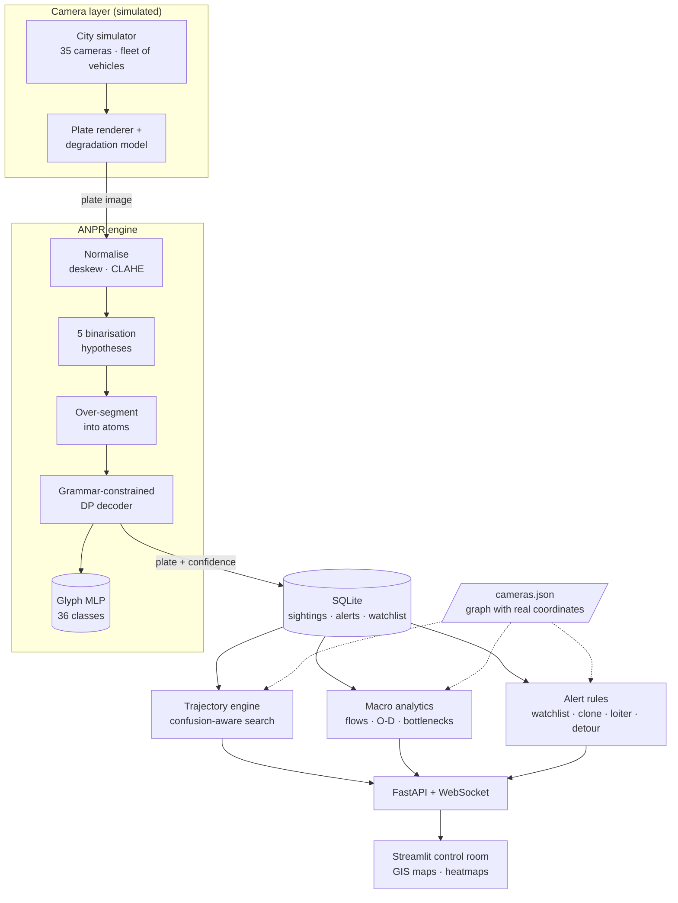

# 👁 GodsEye — city-wide ANPR intelligence platform

**SIH 2026 · Team Armageddon**
**Theme: Smart Automation / Public Safety · Category: Software**

Most cities already own the cameras. What they do not own is a system that joins
those cameras together — that can take one plate number and reconstruct where
that vehicle has been all day, and at the same time turn the same stream of
reads into a live picture of how the whole city is moving.

GodsEye is that layer: a plate reader built for bad photographs, a spatial-
temporal trajectory engine over a GIS camera network, macro traffic analytics
derived from the same reads, and a real-time alert queue on top of both.

---

## Run it

```bash
pip install -r requirements.txt

python seed.py                                  # 6 h of city traffic into SQLite (~20 s)
uvicorn api.main:app --reload --port 8000       # API + live feed  → http://localhost:8000/docs
streamlit run dashboard/app.py                  # control room     → http://localhost:8501
```

The very first run trains the glyph classifier — 3–5 minutes, CPU only — and
caches it in `models/`; every run after that starts in seconds. Nothing here
needs a GPU, an internet connection, or a dataset download. To see the numbers
behind the accuracy claim, and to check every layer end to end:

```bash
python -m anpr.benchmark --samples 100 --json models/benchmark.json
python tests.py                                 # 30-check end-to-end self-check
```

The dashboard reads the database directly, so it works with the API stopped —
the API process is what runs the live camera feed and the incident injectors.

---

## Architecture



---

## 1 · The plate reader

The hard part of ANPR is not clean plates. It is the 9 p.m. capture through
rain, at 30° off-axis, on a plate half covered in road grime. The engine is
built around that case.

**Pipeline.** Normalise (deskew from the ink cloud, CLAHE, fixed height) →
divide out the background field so mud, shadow and glare gradients disappear →
Otsu → deliberately *over*-segment into atoms → decode.

**The decoder is the interesting part.** Classical pipelines commit to one
segmentation and then classify, so a smeared `KA` fused into one blob is
unrecoverable. Here the segmenter is allowed to cut too much, and a dynamic
program searches every way of grouping 1–3 adjacent atoms into characters —
with a third move available, dropping an atom as noise, because mud specks and
rivets segment like characters too. Each grouping is scored against the Bharat
plate grammar (`LL DD LLL DDDD`), which rules out whole families of errors: a
digit can never win a letter slot. Five binarisation hypotheses are decoded and
the highest-scoring read wins.

**The classifier is trained in two stages**, both on synthetic plates with known
ground truth:

1. *Segmentation-aligned* — plates pushed through the real segmenter, kept only
   where the box count matches the plate length, so every label is certain.
2. *Decoder-aligned self-training* — the stage-1 engine reads a fresh batch of
   hard plates; where the decode matches ground truth, the decoder's own
   character spans are harvested as labelled crops. This recovers exactly what
   stage 1 discards — merged characters, mud-covered strokes, fragments glued
   back together.

Held-out glyph accuracy: **98.7 %** over 36 classes, from 31 000 training crops.
Plate-level accuracy is in the table below.

**Confidence is the weakest character, not the average.** One wrong glyph makes
the whole registration wrong, so averaging over ten characters hides exactly the
failure that matters — measured over 600 reads, the mean confidence was 1.00 on
correct reads and 0.91 on wrong ones, which cannot separate them. The minimum
character confidence scores 0.98 against 0.64, and that is what lets the floor
work: dropping the bottom 4 % of reads lifts the accuracy of what actually
reaches the database from 91 % to 94.5 %.

### Measured accuracy

| Capture condition | Plate accuracy | Character accuracy | Stored | Accuracy of stored reads |
|---|---|---|---|---|
| clean | 100% | 100.0% | 100/100 | 100% |
| night / low light | 100% | 100.0% | 100/100 | 100% |
| headlight glare | 98% | 99.3% | 98/100 | 100% |
| rain | 100% | 100.0% | 100/100 | 100% |
| motion blur | 95% | 97.0% | 98/100 | 97% |
| angled (perspective) | 86% | 92.8% | 91/100 | 93% |
| dirty / grimy | 71% | 88.6% | 87/100 | 79% |
| damaged plate | 77% | 92.7% | 95/100 | 80% |
| low resolution | 100% | 100.0% | 100/100 | 100% |
| mixed (two at once) | 85% | 91.3% | 90/100 | 92% |
| **overall** | **91.2%** | **96.2%** | 959/1000 | **94.5%** |

1 000 synthetic plates, 100 per condition, decoded at 13 plates/s on a single CPU core.

`anpr/benchmark.py` produces this table; it is not a quoted figure. *Plate*
means the entire string matched exactly. *Accepted* is the operational number:
of the reads the engine was confident enough to store, how many were exactly
right — a read below the confidence floor (0.70) is dropped rather than written,
which is what a real ANPR node does.

**What the conditions are.** `night` darkens with an uneven light field and
sensor noise; `glare` adds a headlight bloom; `rain` adds streaks, veiling and
defocus; `motion_blur` convolves a directional kernel; `angled` applies a
perspective warp plus rotation; `dirty` lays a dust film over the plate and
splashes it with grime; `damaged` cuts scratches and dents through the
characters; `low_res` decimates and re-upscales; `mixed` composes two of them.
Every capture also carries defocus, sensor noise and exposure drift.

**Limits, stated plainly.** These are synthetic plates rendered by
`anpr/plates.py`, not photographs of Indian traffic — the number is a measure of
the engine against a stated degradation model, not a field trial. The grime and
damage models cap their opacity below 1.0 on purpose: a character with no light
escaping it cannot be read by any system, and burying one under opaque mud would
only manufacture a lower number, not a more honest one. Nothing in the pipeline
is tied to the synthetic renderer: `ANPREngine.read()` takes any plate crop and
`read_frame()` takes a wider photograph, and both paths are exposed through the
API and the dashboard's upload box. The seam for a production upgrade is
`detect_plate_candidates()` — return boxes from a trained detector and the rest
of the pipeline is unchanged.

---

## 2 · Trajectory reconstruction

Type a plate — even a partial or misread one — and the engine returns the
vehicle's day: every camera it passed, in order, with timestamps, the road it
took between each pair, how long that leg took, the speed that implies, and the
compass heading.

**Search is confusion-aware.** An operator who types `KA05MJ1234` still finds
the vehicle a rain-blurred camera stored as `KA05NJ1234`, because candidates are
ranked by an edit distance that charges 0.4 rather than 1.0 for a substitution
the OCR engine is actually known to make (`0↔O`, `8↔B`, `5↔S`, `1↔I` …).

**The reconstruction says when it does not trust itself.** A leg whose implied
speed exceeds 160 km/h is flagged rather than drawn as fact — that pattern means
the same plate is running on two vehicles. Long stops, and legs where the path
had to be inferred through intermediate cameras, are called out too. The map
draws the road polyline from the camera graph, not a straight line between dots.

Also on the page: co-travellers (vehicles repeatedly seen at the same camera
within a couple of minutes — a convoy or a tail), and one click to put the plate
on the watchlist, after which every further sighting raises an alert.

---

## 3 · Macro traffic analytics

Everything is derived from one primitive: two consecutive sightings of the same
plate at two cameras. That pair gives a distance and a time, hence a speed,
hence congestion — aggregated over every plate it gives the city.

| View | What it computes |
|---|---|
| Camera density | Reads per minute, normalised per lane, as a load index |
| Link flows | Volume and median speed on each road link, versus its free-flow speed |
| Bottlenecks | Ranked by **vehicle-minutes of delay caused**, not by slowness alone — a slow empty road is not a problem |
| Origin–destination | Where each plate entered and left the network, with median trip time; gateway-only for through-traffic demand |
| Movement heatmap | Each traversed link sampled along its polyline, weighted by volume × congestion, so heat follows the roads instead of pooling on junctions |
| Trends | Flow, unique vehicles and median network speed over time |

Speeds are only computed between *adjacent* cameras. Between two cameras that
are not neighbours the vehicle's route is inferred, so neither the distance nor
the speed would be a measurement of any particular road — those pairs feed the
O-D matrix instead.

---

## 4 · Alerts

Every sighting is checked as it lands, against a short history of the same
plate, so the cost is a couple of indexed lookups.

| Rule | Fires when | Severity |
|---|---|---|
| `watchlist` | a listed plate is seen anywhere | critical |
| `clone` | two sightings too far apart to be the same vehicle (>160 km/h implied) | critical |
| `loitering` | the same camera passed 4+ times within 45 minutes | medium |
| `detour` | returns to a camera it already passed after covering 4× the direct distance | low |
| `speeding` | implied link speed > 1.6× the road's free-flow limit | medium |
| `odd_hour` | roaming three or more cameras between 01:00 and 05:00 | low |

Every threshold here was set by measuring against the seeded database, not by
taste. `detour` began as "took more than one hop", which fires on every ordinary
journey because sightings are sparse whenever a read is dropped; then as "drove
further than the direct distance", which fired on 28 % of all plates, because
that is what a commute looks like. It now needs a vehicle to return to a camera
it already passed after covering four times the direct distance, which picks out
7 %. Alerts are de-duplicated per plate per rule.

A six-hour seeded day produces roughly 130 watchlist hits (five listed plates),
66 speeding alerts, 32 detours, and a handful of clones and loiterers.

---

## What is real and what is simulated

| Real | Simulated |
|---|---|
| The OCR engine — segmentation, decoder, classifier, confidence | The camera feeds |
| The plate images it reads, including all degradations | Vehicle movement (routed on the graph with a demand profile) |
| Trajectory reconstruction, search, analytics, alert rules | — |
| The camera network's coordinates (35 real Kolkata junctions) | Link lengths, road geometry and free-flow speeds (hand-estimated) |

The simulator renders a plate image per camera crossing and pushes it through
the real engine, so what lands in the database is what the OCR engine read —
misreads included. That is the point: the trajectory and analytics layers cope
with imperfect reads exactly as they would in deployment. Decoding costs ~80 ms,
so live mode decodes as many captures per tick as it can afford and falls back
to an error model calibrated from the benchmark for the rest; every row records
which path produced it in `ocr_variant`, and the ground-truth plate is kept in
`true_plate` so accuracy can be audited end to end.

Swapping the simulator for real cameras means writing rows into `sightings` —
nothing above that table knows where they came from.

---

## API

| Method | Path | Description |
|---|---|---|
| `GET` | `/api/health` | Service state, simulator counters, database stats |
| `GET` | `/api/network` | Camera graph: nodes, links, distances |
| `GET` | `/api/cameras` | All cameras with current load |
| `GET` | `/api/cameras/{id}` | One camera, its neighbours and recent reads |
| `GET` | `/api/sightings/recent` | Latest reads across the network |
| `GET` | `/api/plates/search?q=` | Confusion-aware plate search |
| `GET` | `/api/plates/{plate}/trajectory` | Full reconstructed path with legs |
| `GET` | `/api/plates/{plate}/co-travellers` | Vehicles repeatedly seen alongside |
| `GET` | `/api/analytics/summary` | City headline metrics |
| `GET` | `/api/analytics/density` · `/links` · `/bottlenecks` | Per-camera, per-link, ranked congestion |
| `GET` | `/api/analytics/od` · `/heatmap` · `/trend` · `/sectors` | Demand, map layer, time series |
| `GET` | `/api/alerts` · `/alerts/summary` | Alert queue and counts |
| `POST` | `/api/alerts/{id}/ack` | Acknowledge |
| `GET`/`POST`/`DELETE` | `/api/watchlist` | Manage watchlisted plates |
| `POST` | `/api/anpr/read` | Read a plate from an uploaded image |
| `POST` | `/api/anpr/demo` | Synthesise a plate under a condition and read it back |
| `GET` | `/api/anpr/benchmark` · `/anpr/model` | Measured accuracy, model card |
| `POST` | `/api/sim/live/{on\|off}` · `/sim/inject/{kind}` | Feed control, scripted incidents |
| `WS` | `/api/ws/live` | Live sightings and alerts |

---

## Project structure

```
GodsEye/
├── config.py                 # every path and tunable
├── seed.py                   # backfill a demo day, watchlist, scripted incidents
├── data/cameras.json         # 35 Kolkata junctions + 52 road links, with geometry
├── anpr/
│   ├── plates.py             # plate synthesis + real-world degradation model
│   ├── segment.py            # normalise, binarise, over-segment
│   ├── model.py              # two-stage glyph classifier training
│   ├── ocr.py                # grammar-constrained decoder — the engine
│   └── benchmark.py          # accuracy measurement per condition
├── core/
│   ├── db.py                 # SQLite schema and queries
│   ├── network.py            # camera graph, routing, bearings
│   ├── trajectory.py         # reconstruction + confusion-aware search
│   ├── analytics.py          # density, flows, O-D, bottlenecks, heatmap
│   └── alerts.py             # real-time rules
├── sim/city.py               # traffic simulator feeding the real engine
├── api/                      # FastAPI: REST + WebSocket
└── dashboard/app.py          # Streamlit control room
```

## Tech stack

Python 3.11+ · OpenCV · scikit-learn · NumPy · Pillow · NetworkX · pandas ·
SQLite (WAL) · FastAPI · Uvicorn · Streamlit · PyDeck · Altair

## Team

Built for SIH 2026 by **Team Armageddon**.
